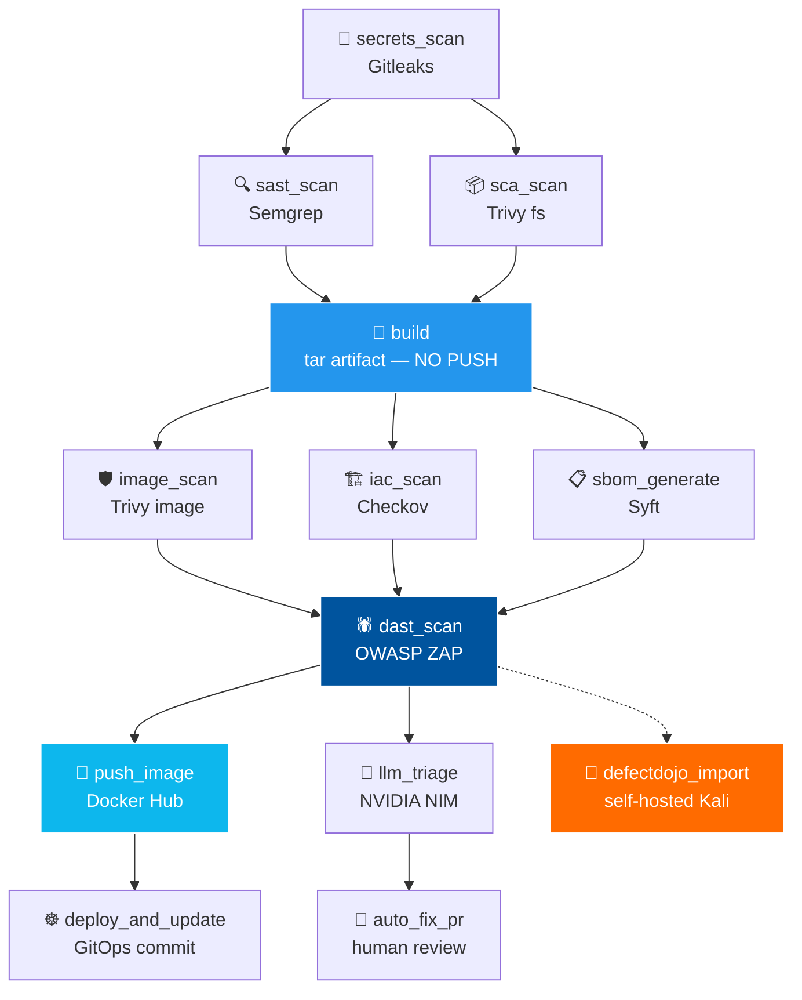
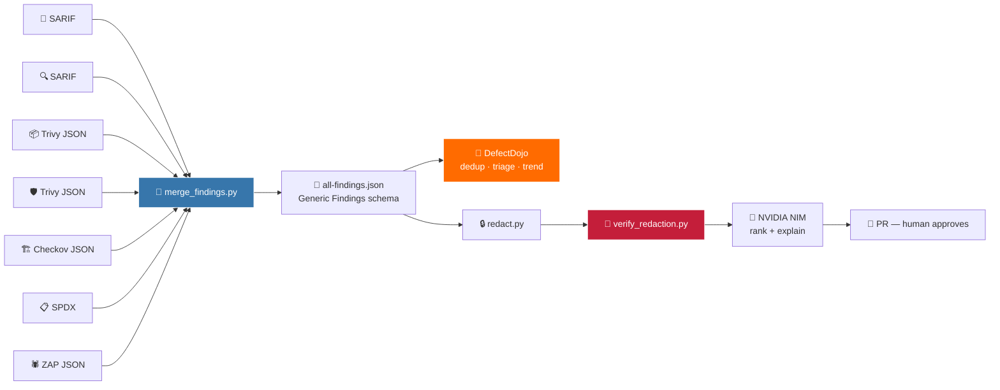

<div align="center">

<br>

# 🛡️ PipelineFortress

### *Nothing unverified reaches the registry.*

**A production-grade DevSecOps pipeline — 8 security gates, consolidated vulnerability management, and AI-assisted triage with a human in the loop.**

<br>


<br>

<table>
<tr>
<td align="center"><h3>13</h3>Jobs</td>
<td align="center"><h3>8</h3>Security controls</td>
<td align="center"><h3>1</h3>Registry egress point</td>
<td align="center"><h3>0</h3>Unverified pushes</td>
</tr>
</table>

<sub>Capstone — IIT Roorkee × Futurense PG Certificate in AI/GenAI Powered Cybersecurity (CAP-DSE-3W)</sub>

</div>

---

## ⚡ Quick Start

```bash
# 1 · Fork, then configure the 7 required secrets
#     Settings → Secrets and variables → Actions

# 2 · Stand up DefectDojo on your self-hosted runner host
git clone https://github.com/DefectDojo/django-DefectDojo.git && cd django-DefectDojo
docker compose up -d
docker compose logs initializer | grep "Admin password:"

# 3 · Register the self-hosted runner (Job 11 needs it)
./config.sh --url https://github.com/<owner>/<repo> --token <TOKEN> && ./run.sh

# 4 · Push to main — the pipeline does the rest
git push origin main
```

<div align="center">

**[📑 Full Table of Contents](#-table-of-contents)** · **[🎯 Why it's built this way](#-design-principle)** · **[🔧 Something broke](#-troubleshooting)**

</div>

---

## 📑 Table of Contents

<table>
<tr>
<td valign="top" width="33%">

**Orientation**
- [🎯 Design Principle](#-design-principle)
- [🗺️ Pipeline Architecture](#️-pipeline-architecture)
- [🎪 Threat Coverage](#-threat-coverage)
- [📋 Job Reference](#-job-reference)

</td>
<td valign="top" width="33%">

**Configuration**
- [🚦 Quality Gates](#-quality-gates)
- [🔇 Trivy Exclusions](#-trivy-exclusions)
- [🔑 Required Secrets](#-required-secrets)
- [📂 Repository Layout](#-repository-layout)
- [⚙️ Setup](#️-setup)

</td>
<td valign="top" width="33%">

**Operations & Assurance**
- [▶️ Running the Pipeline](#️-running-the-pipeline)
- [📊 Findings Flow](#-findings-flow)
- [📐 Framework Mapping](#-framework-mapping)
- [🔒 Engineering Decisions](#-engineering-decisions)
- [🔧 Troubleshooting](#-troubleshooting)
- [🗓️ Roadmap](#️-roadmap)

</td>
</tr>
</table>

---

## 🎯 Design Principle

> ### **Nothing unverified reaches the registry.**

The image is built once, saved as a **tar artifact**, and passed between jobs. It is scanned, SBOM'd, and DAST-tested as a local file. Only after the DAST gate passes does a separate job load that same tar and push it.

<table>
<tr>
<td width="50%" valign="top">

#### ❌ Conventional

```
build ─► push ─► scan ─► 🚨 alert
            │
     already public
```

The image is in the registry before anyone knows if it's safe. A failed scan produces an **alert**, not a **prevention**. Remediation means yanking a tag consumers may already have pulled.

</td>
<td width="50%" valign="top">

#### ✅ PipelineFortress

```
build ─► scan ─► DAST ─► push ✅
   │                       │
  tar ──── same bytes ─────┘
```

The bytes scanned are **byte-identical** to the bytes published. No rebuild between scan and publish, so there is no window in which the two can diverge.

</td>
</tr>
</table>

This closes the *"scanned one image, shipped another"* gap — the same class of weakness that makes build-system compromise so effective in real supply-chain attacks.

---

## 🗺️ Pipeline Architecture



> 🎯 **DefectDojo import runs `if: always()`** — findings are recorded whether or not a gate blocked the push. A blocked release should still produce a tracked, triageable record, otherwise the block is invisible to anyone not reading CI logs.

---

## 🎪 Threat Coverage

What each control actually defends against, and where it sits in the software supply chain.

| Stage | Threat | Control | Failure mode without it |
|-------|--------|---------|-------------------------|
| 📝 **Source** | Committed credentials | 🔑 Gitleaks | Key leaks via public repo or git history |
| 📝 **Source** | Injection, auth flaws, unsafe deserialisation | 🔍 Semgrep | Vulnerable code ships to production |
| 📦 **Dependencies** | Known-vulnerable packages, typosquats | 📦 Trivy fs | Transitive CVE inherited silently |
| 🐳 **Build** | Vulnerable base image, bloated layers | 🛡️ Trivy image | OS-level RCE in a container you didn't write |
| 🏗️ **Infra** | Privileged pods, missing NetworkPolicy, no limits | 🏗️ Checkov | Container escape, lateral movement |
| 📋 **Provenance** | Unknown component inventory | 📋 Syft SBOM | No answer to *"are we affected?"* during a zero-day |
| 🌐 **Runtime** | Exploitable behaviour only visible when running | 🕷️ OWASP ZAP | Config-dependent flaws missed by static analysis |
| 🚀 **Release** | Publishing an unverified artifact | 🚦 Post-DAST push | Vulnerable image consumed downstream |

---

## 📋 Job Reference

| # | Job | 🖥️ Runner | 🔧 Tool | Purpose |
|:--:|-----|:--------:|---------|---------|
| 1️⃣ | 🔑 `secrets_scan` | ubuntu | **Gitleaks** | Full-history secret detection |
| 2️⃣ | 🔍 `sast_scan` | ubuntu | **Semgrep** | JS · Node · OWASP Top 10 · JWT · XSS · SQLi |
| 3️⃣ | 📦 `sca_scan` | ubuntu | **Trivy** (fs) | Dependency CVE scan |
| 4️⃣ | 🐳 `build` | ubuntu | **Docker** | Build + save tar — ⛔ **no push** |
| 5️⃣ | 🛡️ `image_scan` | ubuntu | **Trivy** (image) | OS / layer CVEs in tarball mode |
| 6️⃣ | 🏗️ `iac_scan` | ubuntu | **Checkov** | Kubernetes manifest misconfigs |
| 7️⃣ | 📋 `sbom_generate` | ubuntu | **Syft** | Syft JSON + SPDX JSON |
| 8️⃣ | 🕷️ `dast_scan` | ubuntu | **OWASP ZAP** | Baseline scan against live container |
| 9️⃣ | 🚀 `push_image` | ubuntu | **Docker** | ✅ Push — **post-DAST only** |
| 🔟 | ☸️ `deploy_and_update` | ubuntu | **git** | GitOps bump → ArgoCD sync |
| 1️⃣1️⃣ | 🎯 `consolidate_and_dojo_import` | 🔴 **self-hosted** | **DefectDojo** | Merge findings → API v2 |
| 1️⃣2️⃣ | 🤖 `llm_triage` | ubuntu | **NVIDIA NIM** | Redact → triage → rank |
| 1️⃣3️⃣ | 🔧 `auto_fix_pr` | ubuntu | **create-pull-request** | Draft fixes for top 3 findings |

---

## 🚦 Quality Gates

### 🔴 Enforcing — pipeline stops

| Gate | Job | Threshold |
|------|-----|-----------|
| 🔍 **SAST** | `sast_scan` | Any Semgrep `ERROR`-level finding |
| 🏗️ **IaC** | `iac_scan` | Any CRITICAL / HIGH Checkov failure in `k8s/` |
| 🕷️ **DAST** | `dast_scan` | Any ZAP alert with `riskcode == 3` (HIGH) |

### 🟡 Audit mode — warns, continues

| Gate | Job | Threshold *(when enforcing)* |
|------|-----|------------------------------|
| 📦 **SCA** | `sca_scan` | More than 5 CRITICAL dependency CVEs |
| 🛡️ **Image** | `image_scan` | Any CRITICAL OS / runtime CVE |

> ℹ️ **Why audit mode?** Juice Shop is an *intentionally vulnerable* application on an older Node base. Enforcing these would block every run — a gate that always fires teaches nothing and gets ignored, which is worse than no gate.

### 🔄 Promoting a gate: Count → Block

Each audit-mode gate has exactly one commented line:

```yaml
if [ "$CRITICAL_COUNT" -gt "0" ]; then
  echo "::warning::Image gate would have FAILED — $CRITICAL_COUNT CRITICAL OS CVEs (audit mode)"
  # exit 1   # ← 🔓 uncomment to enforce
fi
```

<div align="center">

**`🟡 Observe`** → **`🔧 Tune exclusions`** → **`🔴 Enforce`**

<sub>The same promotion pattern used for WAF rules in production: run in Count, measure the false-positive rate, then switch to Block.</sub>

</div>

---

## 🔇 Trivy Exclusions

Two layers of noise suppression, applied to both Trivy jobs:

```yaml
ignore-unfixed: true          # 🚫 CVEs with no patch available
trivyignores: .trivyignore    # 📝 consciously accepted CVEs
```

<table>
<tr>
<td width="50%" valign="top">

#### 🚫 `ignore-unfixed: true`

Suppresses CVEs with **no available patched version**. On an old Node base this removes the bulk of CRITICAL noise — findings you could not act on even with unlimited time.

*Automatic. No maintenance burden.*

</td>
<td width="50%" valign="top">

#### 📝 `.trivyignore`

A committed **risk-acceptance register**. Only *fixable* CVEs you have deliberately accepted — each with a reason and review date.

*Deliberate. Reviewed quarterly.*

</td>
</tr>
</table>

```bash
# .trivyignore
CVE-2023-37903   # vm2 sandbox escape — intentional Juice Shop vuln, tracked in Dojo (review 2026-10-20)
CVE-2019-10744   # lodash prototype pollution — required by Juice Shop challenge (review 2026-10-20)
```

> ⚠️ **Caveat worth knowing:** `.trivyignore` suppresses findings from the report entirely — the gate never sees them, and **neither does DefectDojo**. For a CVE that should be *visible but non-blocking*, leave it out of the file and handle it in gate logic instead.

> 💡 `image_scan` runs `actions/checkout` **before** the Trivy step specifically so `.trivyignore` exists in the working directory even though the scan operates in tarball mode.

---

## 🔑 Required Secrets

**Settings → Secrets and variables → Actions**

| 🔐 Secret | Used by | Notes |
|-----------|---------|-------|
| `DOCKERHUB_USERNAME` | build · push_image | Also composes `DOCKERHUB_REPO` |
| `DOCKERHUB_TOKEN` | push_image | ⚠️ Access token, **not** account password |
| `GIT_EMAIL` | deploy_and_update | Commit identity for GitOps loop |
| `GIT_USERNAME` | deploy_and_update | Commit identity for GitOps loop |
| `DEFECTDOJO_URL` | dojo_import | `http://localhost:8080` — resolves on self-hosted runner |
| `DEFECTDOJO_API_KEY` | dojo_import | API v2 token |
| `NVIDIA_NIM_API_KEY` | llm_triage | LLM triage inference |

> ✅ `GITHUB_TOKEN` is injected automatically — no configuration needed.

---

## 📂 Repository Layout

```
📦 PipelineFortress
├── 📁 .github/workflows/
│   └── 📄 devsecops-pipeline.yml     # ⚙️  the pipeline
├── 📝 .trivyignore                    # 🔇 risk acceptance register
├── 🐳 Dockerfile
├── 🔢 version.txt                     # integer version seed
├── ☸️  deployment.yaml                 # GitOps target manifest
├── 📁 k8s/                            # 🏗️  scanned by Checkov
├── 📁 scripts/
│   └── 🐍 merge_findings.py          # multi-scanner → Dojo generic format
└── 📁 triage/
    ├── 🐍 merge_findings.py
    ├── 🐍 redact.py                   # 🔒 strip secrets pre-LLM
    ├── 🐍 verify_redaction.py         # 🚨 fail build if a secret survives
    ├── 🐍 triage.py                   # 🤖 NVIDIA NIM call
    └── 🐍 make_fix_files.py           # 🔧 draft remediation
```

---

## ⚙️ Setup

<details>
<summary><b>🖥️ Self-Hosted Runner (Kali)</b> — required for Job 11</summary>

<br>

Job 11 runs on `self-hosted` so `localhost:8080` resolves to DefectDojo on the same machine — **no tunnel, no public exposure, no inbound firewall rule**.

```bash
# GitHub → Settings → Actions → Runners → New self-hosted runner
mkdir actions-runner && cd actions-runner
curl -o actions-runner-linux-x64.tar.gz -L <URL_FROM_GITHUB>
tar xzf actions-runner-linux-x64.tar.gz
./config.sh --url https://github.com/<owner>/<repo> --token <TOKEN>
./run.sh
```

**Runner requirements:** `python3` · `curl` · `git` on PATH

</details>

<details>
<summary><b>🎯 DefectDojo</b> — vulnerability aggregation</summary>

<br>

```bash
git clone https://github.com/DefectDojo/django-DefectDojo.git
cd django-DefectDojo
docker compose build
docker compose up -d

# 🔑 Auto-generated admin password — printed on FIRST boot only
docker compose logs initializer | grep "Admin password:"
```

**Lost the password?**

```bash
docker compose exec uwsgi ./manage.py changepassword admin
```

Generate the API v2 token at `http://localhost:8080/api/key-v2`.

**Auto-created context** (`auto_create_context=True`) — created on first run, matched by name thereafter:

| Level | Value |
|-------|-------|
| 📁 Product Type | Personal Projects |
| 📦 Product | PipelineFortress |
| 🎯 Engagement | CI Pipeline Runs |

</details>

<details>
<summary><b>✅ Prerequisites checklist</b></summary>

<br>

- [ ] GitHub repository with Actions enabled
- [ ] Docker Hub account + access token
- [ ] Self-hosted runner registered (Kali or any Linux host)
- [ ] DefectDojo reachable from that runner
- [ ] NVIDIA NIM API key
- [ ] `version.txt` in repo root
- [ ] `deployment.yaml` with an `image:` line matching the sed pattern
- [ ] `k8s/` directory containing manifests
- [ ] All 7 secrets configured

</details>

---

## ▶️ Running the Pipeline

**Trigger:** push to `main`

<table>
<tr><td width="60px" align="center">1️⃣</td><td>Secrets scan completes → SAST and SCA fan out in <b>parallel</b></td></tr>
<tr><td align="center">2️⃣</td><td>Build produces the tar artifact <i>(retention 1 day — transport, not evidence)</i></td></tr>
<tr><td align="center">3️⃣</td><td>Image scan · IaC scan · SBOM run in <b>parallel</b> against the tar</td></tr>
<tr><td align="center">4️⃣</td><td>DAST starts the container and runs the ZAP baseline</td></tr>
<tr><td align="center">5️⃣</td><td>🚀 On DAST pass → <code>push_image</code> publishes to Docker Hub</td></tr>
<tr><td align="center">6️⃣</td><td>☸️ GitOps commit bumps the manifest → ArgoCD syncs</td></tr>
<tr><td align="center">7️⃣</td><td>🎯 DefectDojo import + 🤖 LLM triage run alongside the deploy path</td></tr>
</table>

### 📟 Sample run summary

```
========================================
  PIPELINEFORTRESS — RUN COMPLETE
========================================
  Image  : ***/gitops-juiceshop-devsecops:7
  Commit : a3f91c2
  Branch : main
  Gates  : Secrets | SAST | SCA | Build
           Image | IaC | SBOM | DAST
  Push   : AFTER DAST gate (verified image)
  Status : All gates passed — ArgoCD syncing
========================================
```

### 🔢 Versioning

```bash
RAW=$(cat version.txt)              # "1.0"
INT=$(echo "$RAW" | cut -d'.' -f1)  # "1"    ← strip decimal
VERSION=$(( INT + 1 ))              # 2
```

> 💡 Bash arithmetic rejects floats — `$(( 1.0 + 1 ))` errors, `$(( 1 + 1 ))` doesn't.

The computed version is exposed as a **job output** rather than recalculated downstream, so the pushed tag and the tag written into `deployment.yaml` **cannot drift**.

---

## 📊 Findings Flow

Seven scanners produce seven incompatible output formats. `merge_findings.py` normalises them into DefectDojo's Generic Findings schema so everything lands in one queue with consistent severity.



Deduplication and finding-age tracking happen in DefectDojo, not in CI — the pipeline's job is to produce evidence, not to remember it.

---

## 📐 Framework Mapping

Controls mapped to the standards an assessor or auditor is likely to ask about.

| Control | NIST SSDF (SP 800-218) | OWASP DSOMM | SLSA |
|---------|------------------------|-------------|------|
| 🔑 Secret scanning | PW.1.3 · RV.1.1 | Static depth 2 | — |
| 🔍 SAST | PW.7.2 · PW.8.2 | Static depth 3 | — |
| 📦 SCA | PW.4.1 · RV.1.1 | Consumption depth 2 | — |
| 🛡️ Image scanning | PW.4.4 · RV.1.2 | Infrastructure depth 3 | — |
| 🏗️ IaC scanning | PO.5.1 · PW.9.1 | Infrastructure depth 2 | — |
| 📋 SBOM | PS.3.2 | Consumption depth 3 | Build L1 — provenance |
| 🕷️ DAST | PW.8.2 · RV.1.1 | Dynamic depth 2 | — |
| 🚦 Post-DAST push | PS.1.1 · PS.2.1 | Deployment depth 3 | Build L2 — build integrity |
| 🎯 DefectDojo | RV.2.1 · RV.3.3 | Culture depth 2 | — |

> 🇪🇺 For EU-facing contexts, the SBOM, evidence retention, and vulnerability-tracking controls map onto **NIS2** Art. 21(2)(a)/(e) supply-chain and handling obligations, and the **Cyber Resilience Act** Annex I Part II reporting expectations.

---

## 🔒 Engineering Decisions

<table>
<tr>
<td width="50px" align="center" valign="top">🚪</td>
<td>

**Registry egress is a single chokepoint**

`push_image` is the **only** job holding Docker Hub credentials. Compromise or misconfiguration of any scan job cannot cause an unverified publish, because no other job can authenticate to the registry. Blast radius of a compromised scanner is bounded at *"the finding was wrong"*, not *"a malicious image shipped"*.

</td>
</tr>
<tr>
<td align="center" valign="top">🔏</td>
<td>

**Redaction precedes LLM egress — and is verified**

Job 12 runs `redact.py`, then `verify_redaction.py` **fails the build** if a secret pattern survives. Scanner output routinely contains file paths, code snippets, and occasionally credential material. The prompt actually sent is retained as `prompt_sent_to_llm.txt`, so redaction is auditable after the fact rather than merely asserted.

</td>
</tr>
<tr>
<td align="center" valign="top">👤</td>
<td>

**LLM output is a proposal, never a merge**

Job 13 opens a PR labelled `llm-generated`, scoped to `security/remediation/**`. A human reviews and merges. **The model has no write path to `main`.** Model output is treated as untrusted input to a human process, which is the only defensible posture for generated security fixes.

</td>
</tr>
<tr>
<td align="center" valign="top">🔐</td>
<td>

**Least-privilege job permissions**

`contents: write` → only `deploy_and_update`. `pull-requests: write` → only `auto_fix_pr`. Every scan job runs with default **read-only** token scope. Permissions are declared per-job rather than workflow-wide.

</td>
</tr>
<tr>
<td align="center" valign="top">🛟</td>
<td>

**Gates fail safe, not open — and never crash**

Every gate wraps its parser in `try/except` and degrades to a count of zero on malformed input, so a corrupt scanner report cannot take down the pipeline. Each scan step writes a valid empty report if the tool produced nothing, so downstream jobs always have well-formed input.

</td>
</tr>
<tr>
<td align="center" valign="top">📚</td>
<td>

**Evidence retention matched to purpose**

Scanner reports **30 days** · SBOMs and triage output **90 days** · intermediate image tar **1 day**. The tar is a transport mechanism between jobs, not evidence, and is sized accordingly.

</td>
</tr>
</table>

---

## 🔧 Troubleshooting

<details>
<summary>🐍 <b><code>SyntaxError: expected 'except' or 'finally' block</code></b></summary>

<br>

An inline Python gate is missing its `except` block. Every gate uses `try/except` so a malformed or empty scanner report degrades to a count of **zero** rather than crashing the step.

```python
try:
    ...
except Exception:
    print(0)      # ← mandatory
```

</details>

<details>
<summary>🎯 <b>DefectDojo returns HTTP 400</b></summary>

<br>

Usually a `scan_type` mismatch or malformed generic findings file. Inspect the uploaded `dojo-import-response.json` artifact — DefectDojo returns **field-level validation errors** in the body.

</details>

<details>
<summary>🔐 <b>DefectDojo returns HTTP 401</b></summary>

<br>

Token expired, or the `Authorization: Token <key>` header is malformed. Regenerate at `/api/key-v2`.

</details>

<details>
<summary>📭 <b>Artifact download finds nothing</b></summary>

<br>

The download pattern is `*-report*`. Any new scanner artifact **must** be named to match — this is why the SBOM artifact is `sbom-report`, not `sbom-reports`.

</details>

<details>
<summary>🕷️ <b>DAST gate blocks every run</b></summary>

<br>

Expected on Juice Shop. Either move the gate to **audit mode** using the same pattern as the Trivy gates, or raise the threshold above a tolerance count instead of gating on zero.

</details>

<details>
<summary>🏗️ <b>Architecture mismatch on the self-hosted runner</b></summary>

<br>

DefectDojo images are built for **amd64**. On ARM, build locally rather than pulling, or set `DOCKER_DEFAULT_PLATFORM=linux/amd64` — expect slow emulated startup.

</details>

<details>
<summary>🔢 <b><code>syntax error: invalid arithmetic operator</code> on version bump</b></summary>

<br>

`version.txt` contains a float (`1.0`). Bash `$(( ))` accepts integers only. The pipeline strips the decimal with `cut -d'.' -f1` before incrementing — if you changed that line, restore it.

</details>

---

## 🗓️ Roadmap

- [ ] ✍️ **Cosign signing** + SLSA provenance attestation in `push_image` — pushes Build integrity to **SLSA L3**
- [ ] 🔴 **Promote Trivy gates** from audit to enforcing once the base image is updated
- [ ] 🛂 **Admission control** (Kyverno / OPA Gatekeeper) to reject unsigned images at deploy time
- [ ] 📈 **Trend reporting** from DefectDojo — finding age, remediation velocity, MTTR by severity
- [ ] ⏰ **Automated expiry check** on `.trivyignore` review dates — fail the build on stale acceptances
- [ ] 🧪 **Semgrep custom rules** for project-specific patterns beyond the community rulesets

---

<div align="center">

<br>

### 🛡️ PipelineFortress

*Built on defence-in-depth, shift-left, and the assumption that any single gate can fail.*

<sub>Every control here is a compensating control for the one next to it.</sub>

<br>

</div>
